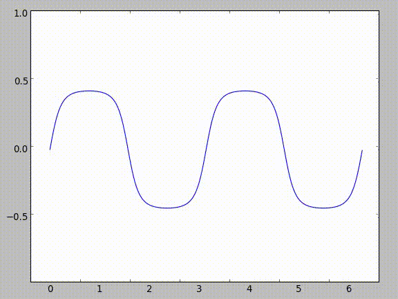

Having just recently added LaTeX support to my site and also thinking about this interesting problem, I figured I'd write something up here.

The general premise is what if you took a function and defined it as a composition of another function and itself:

$$f(x) = g(f(x))$$

For obvious reasons, this doesn't work because you're defining a function as something based on itself. It's like using a word you're trying to define in its own definition. To get around that, we can do some hacky stuff to make it a sequence:

$$f_n(x) = g(f_{n-1}(x))$$

Then, if we take the limit as $$n \to\infty$$ approaches infinity of this sequence:

$$\lim_{n\to\infty} f_n(x) = g(g(g(...g(g(x))...)))$$

This might seem pointless or strange so far, but if you substitute g(x) for sin(x) you can get some really interesting properties.

As you can see in the following image, as you increase the amount of sines in the composition (as $$n \to \infty$$), the sequence approximates the line $$y = 0$$.

 
This makes sense - if you think about plugging in various values into sine, they all come out smaller than they get inputted. Take $$\frac{\pi}{2}$$ for example. As you continue taking the sine of the result, it gets smaller and smaller.

| Iteration   | Input | Output |
|:-----------:|:-------:|:--------:|
| 1 | $$\frac{\pi}{2}$$ | 1 |
| 2 | 1 | 0.8414709848 |
| 3 | 0.8414709848 | 0.74562414166 |
| 4 | 0.74562414166 | 0.67843047736 |
| 5 | 0.67843047736 | 0.62757183204 |
| 6 | 0.62757183204 | 0.58718099657 |
| 7 | 0.58718099657 | 0.55401639075 |

 

However, things really get strange when you start taking the derivative. Using chain rule:

$$ f_n'(x) = g'(f_{n-1}(x))f_{n-1}'(x)$$

When we plug in $$cos(x)$$ for $$g'(x)$$, we get:

$$ f_n'(x) = cos(f_{n-1}(x))f_{n-1}'(x) $$

Now, since we know that $$ \lim_{n\to\infty} f_n(x) = 0 $$, and that as $$n\to\infty$$ the difference between $$f_n(x)$$ and $$f_{n-1}(x)$$ becomes negligible, we can re-write the equation for the sequence's theoretical derivative as:

$$ f_n'(x) = cos(0) f_{n-1}'(x)$$

Since $$f_{n-1}'(x)$$ is essentially equal to $$f_n'(x)$$ the sequence becomes an infinite product of $$cos(0)$$, looking like

$$ f_n'(x) = cos(0)cos(0)cos(0)... $$

Due to the trigonometric properties of cosine, $$cos(0) = 1$$, therefore $$f_n'(x)$$ equals an infinite product of ones, which ends up being equal to one.
This means we have a function that approximates a horizontal line with a derivative of one everywhere. Obviously, there were multiple mathy hacks to make this work, but it's a fun function to think about.

Of course, there's another way to find the derivative which results in the derivative being all real numbers, and it's a little bit less hacky. Since $$f_n(x)$$ essentially equals $$f_{n-1}(x)$$ as $$n\to\infty$$, we can substitute $$f_{n-1}(x)$$ with $$f_n(x)$$:

$$ f_n(x) = sin(f_n(x)) $$

 

$$ f_n'(x) = cos(0)f_n'(x) $$

 

$$ \frac{f_n'(x)}{f_n'(x)} = 1 $$

Therefore, $$f_n'(x)$$ can be any real (or complex) number. Even though this derivation makes more sense (to me at least), it's more fun to show people the other one, because it's so counter-intuitive. A fun party trick for math majors!
