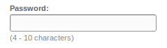
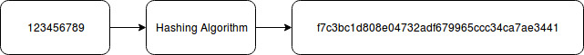

I recently made an account with Shutterfly, and something struck me as odd. When asked to provide a password, they had a minimum character length (obviously, you don't want a password being too simple), but they also had a maximum. That is _bad_, and this post will attempt to explain why that is so.

First of all, let establish what passwords serve to do. A person provides their password, then an application takes this password to make sure that the person trying to log in or access information is who they say they are. This might seem pretty straightforwards, but the difficulty arises when trying to make sure that a person's password isn't able to be acquired by malicious hackers or bad people, or even people who accidentally log on as other people.

A simple solution might be though of by someone saying, "Okay, I'll just keep the list of people's passwords on a secure computer somewhere, and then whenever someone needs to log in, I compare their password to the one on the list." Although the idea of comparing the given password to a stored one isn't altogether wrong, what would happen if someone managed to get into that secure computer? They would have a list of all the peoples' passwords, which is a big no-no.

It is incredibly difficult to make something completely secure, and if the computer holding the passwords is on the network, interacting with the other parts of a website, server, or computer to verify passwords, then it is vulnerable to some sort of exploit or hack. If you need to be able to access something, just like in the real world, then someone else can take advantage of that entrance that you use to get places they shouldn't. The only way to make it completely safe is to not have any way of access, but since we need to be able to compare passwords, you can't leave it completely isolated without access.

To counteract this, you can either try and increase the security of the computer itself, or somehow protect the passwords themselves, so it's more difficult to determine what each password is. As we just talked about, although it's possible to increase security of the storage of passwords, it's not possible to make it completely protected. That leaves you with the other option: protecting the values of the passwords themselves, so that when a malicious person gains access to the database, they still can't take advantage of the passwords. This protection takes the form of something called hashing.

The premise of hashing is a one-way algorithm. You feed a password to this hashing algorithm, then it spits out a pseudorandom number, which is a predictably random number - provided the input (the password) is consistent, then the output, the pseudorandom number, will be consistent as well.

For example:

And if you were to do it again, regardless of where you are, what you're doing, what time of day it is, et-cetera, it will still result in the same number. Try it yourself! There's plenty of websites that will let you experiment with hashing different things, like [this one](https://caligatio.github.io/jsSHA/) which I especially like due to its customizability and realtime visualizing of the hash changing.

You might be wondering why this hashing thing seems like such a big deal; I mean, if the value is always the same, then what's to keep people from working backwards on the hashed value to get the actual password? The main preventative measure is computing power. Hashing algorithms have been designed to be fairly easy to compute in one direction, but take a much larger amount of processing power to reverse engineer ([side note, this reverse engineering of a hash is sort of what bitcoin and other cryptocurrencies are doing. Here's a great video about that](https://www.youtube.com/watch?v=bBC-nXj3Ng4)).

If you have two prime numbers, say, `2,852,748,353,893` and `6,818,025,871,073`. It's not too difficult to multiply them together, both for a person and a computer, and given enough time, you could get the answer: `19,450,112,080,503,388,195,637,189`
However, if you try and factor that number to figure out the two prime numbers that you multiplied to get that number, it would take a _substantially_ longer time. For a computer, this size of a number isn't too difficult, but what happens when you use a number that's on the order of magnitude of 10^600 or larger, and you need to factor it? It gets a lot harder. Although that's not exactly what's happening with hashing algorithms, they operate on the same principle that it takes minimal effort or computing power to go one way, but astronomical power to go the other way. That way, you can't take a hashed value and work it backwards into the original text or values that were hashed.

This idea of hashing passwords makes all of our data much more secure. There's some clever things that people do to make them more secure, like salting passwords, but I won't go into the sake of keeping this fairly simple.

One of the coolest things about most hashing algorithms is that they don't have required lengths. Regardless of what you give it, it will spit out a pseudorandom output back at you, and even the slightest change will result in a completely different value getting returned. If you give it a long block of text, even a whole book as a hash, then recalculate the hash off of the identical book with a single space missing between two letters, it will result in a completely different pseudorandom hash.

Another important thing to note about most hashing algorithms is that regardless of that input length, it will always return a consistent length for the random value. Regardless of if you provide the algorithm with `a` or this entire website as an input, it will always be X amount of bytes long. The exact length changes with the hashing algorithm, but doesn't change between inputs of any given hash.

Now, with some of the details of how a hashing algorithm works, we can return to how Shutterfly's site was exhibiting questionable information. This premise of not having set lengths as inputs but outputting a set length means that in theory, were they using a hashing algorithm to protect passwords, they wouldn't need to set any sort of parameterization for how people should format their passwords because they will all result in the same length hash, which is the thing stored in the database and compared with a given password.

If you've never programmed before this might not make sense, but one of the largest limitations that needs to be worked around fairly frequently is variable-length data storage and manipulation, doing operations on things that don't have a known length that you need to store.

One solution, which I believe Shutterfly to be doing, is request that the users limit their password lengths so that they can be stored together in a database of passwords that have a set maximum length (that haven't been protected by hashing). The other solution, which is much easier to program for and safer for your passwords, is just to hash everyones' passwords before putting them in a database.

So, where does this leave us? Shutterfly might have a pretty bad security flaw; I've contacted them several times and rooted around online to see if there's any good explanation of why they're doing what they're doing, and I couldn't find one. Regardless, **_if you see this, change your password to something that's not one of your common passwords for Shutterfly_**, and any other site that you might see that's doing this. You can never be too safe, and I hope the readers of this post might have gotten a better understanding of how passwords are stored in most databases and of the most common way to protect them.
