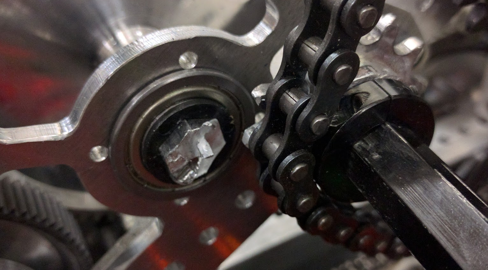
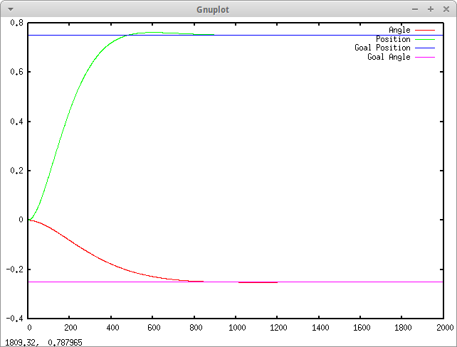
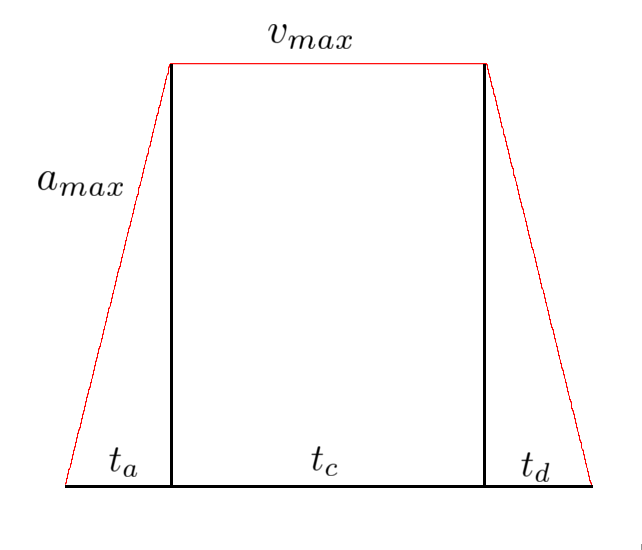
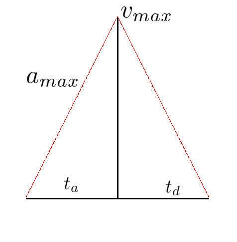

***This was initially written as a paper, so apologies for the formal language.***

Motion profiling is the practice of setting non-static goals for a system to reduce sudden accelerations and impossible movements. It's important to reduce the wear and tear on mechanisms on robots and controlled systems, and allows more effective use of certain aspects of controllers, like integral terms.

**Systems Without Motion Profiling**

When you have a system which doesn't profile its goals, it ends up getting given unrealistic goals and causes motors and inputs to suffer. One example, from Citrus Circuits' 2016 robot Adrian, was the large pivot arm. With so much mass, the arm put serious strain on the physical components of the robot, like the central shaft on the pivot, and on the motors, which contributed to them breaking multiple times. You can see this in Fig. 1 an image of the time the central shaft of the pivot sheared completely through, due to slight imperfections in manufacturing along with repeated heavy stress on the part.

 

Programmatically, systems without motion profiling are simple. You set a goal, the controller responds by trying to make the system converge towards the goal, giving it a voltage or input which was tuned by a person to make it converge most effectively. Below, in Figure 2, is a graph of modeled system responding to an unprofiled system:

 

It responds well, but not ideally. In addition, instead of ramping up at the maximum acceleration of the drivetrain, it gives full voltage to the motors, which draws a lot of current and creates brownouts on an actual system.

**Trapezoidal Motion Profiling**

To solve these problems, you can profile the goal, accounting for the maximum accelerations and velocities of the drivetrain or other system you are modelling. Profiling the goal also allows you to have a lot of feed-forwards control, not relying as heavily on sensors and other inputs to the system. Deriving the trapezoidal motion profile goes like this.
You have two constraints: $a\_{max}$ and $v\_{max}$. When you are given a goal distance $d\_{goal}$, the distance under the velocity profile must equal this distance, or $\int\_{0}^{t\_{total}}{(v)dt} = d\_{goal}$. Don't get worried, because although calculus can indeed be used as a way to determine the constraints of the profile more intuitively and easily, you can also use simple geometry and kinematic equations. Instead of contemplating this integral, we can break down the trapezoid into multiple parts; the acceleration, cruising, and deceleration.

We need to find first the times it takes to accelerate and decelerate, and identify the distance that we travel in that time. Since you know the slope of the line $a\_{max}$, and you know the starting point, some $v\_s$, and the maximum velocity $v\_{max}$, you can figure out the time travelled by considering the time $t\_a * a\_{max}$ to be equal to the difference between $v\_s$ and $v\_{max}$. You can do the same for the deceleration time, but with an ending velocity $v\_e$ instead.

$$t\_a = \frac{v\_{max} - v\_s}{a\_{max}}$$

$$t\_d = \frac{v\_{max} - v\_e}{a\_{max}}$$

Notice we are not assuming $v\_s$ or $v\_e$ to be zero - this gives us greater flexibility in generating profiles. For example, if we were already moving forwards while going into the profile, you don't want to miscalculate the time to accelerate because you are already moving at a velocity. Similarly, if you have a target ending velocity, subtracting $v\_e$ accommodates for this.
With $t\_a$ and $t\_d$ calculated, you can now calculate the distance traveled while accelerating and decelerating, which only leaves you with $t\_c$ to calculate to reach the desired distance.

The distance travelled during acceleration is equal to the average velocity of that section times the time that it travels.

$$d\_a = t\_a\frac{v\_s + v\_{max}}{2}$$

This can be simplified by substituting the times for their respective equations.

$$d\_a = (\frac{v\_{max} - v\_s}{a\_{max}})(\frac{v\_s + v\_{max}}{2})$$

$$d\_a = \frac{v\_{max}^2 - v\_s^2}{2a\_{max}}$$

The sum of each part's distance should be equal to the total distance.

$$d\_{goal} = d\_a + d\_c + d\_d$$

Having calculated $d\_a$ and $d\_d$, you can substitute this into the equation. Using basic kinematic equations you can also determine $d\_c = t\_c v\_{max}$, and substitute that as well.

$$d\_{goal} = \frac{v\_{max}^2 - v\_s^2}{2a\_{max}} + \frac{v\_{max}^2 - v\_e^2}{2a\_{max}} + t\_c v\_{max}$$

Solving for $t\_c$, our unknown value which is the only thing preventing us from knowing the trapezoidal profile's constraints.

$$t\_c = \frac{d\_{goal} - \frac{v\_{max}^2 - v\_s^2}{2a\_{max}} + \frac{v\_{max}^2 - v\_e^2}{2a\_{max}}}{v\_{max}}$$

This equation is what finally allows us to determine the profile's length and shape. You can also see that the only three values needed to calculate this cruising time is the maximum velocity, maximum acceleration, and the desired distance. With this calculation, you can then write code which calculates the time for each portion of the profile, then sets a goal based on where it is in the profile and how much time has elapsed.

However, there is one problem with this. If the target distance $d\_{goal}$ is less than the distance it takes to accelerate and decelerate from your starting velocity $v\_s$ and ending velocity $v\_e$, then instead of making a trapezoidal motion profile, you will have to make a triangular motion profile. This math is slightly different, because you now have a lower maximum velocity than the physical $v\_{max}$ constraint on the drivetrain or system.

Without a cruising section, you must now calculate the new maximum velocity to be able to calculate the time for acceleration and deceleration. Assuming again to have non-zero starting and ending velocities, the acceleration times are $t\_a = \frac{v\_{max} - v\_s}{a\_{max}}$ and $t\_d = \frac{v\_{max} - v\_e}{a\_{max}}$. In addition, the equation resulting in $d\_{goal}$ still holds.

$$d\_{goal} = \frac{v\_{max} + v\_s}{2} t\_a + \frac{v\_{max} + v\_e}{2} t\_d$$

However, since we no longer know $v\_{max}$, we'll need to substitute the times and solve for it.

$$d\_{goal} = (\frac{v\_{max} + v\_s}{2})(\frac{v\_{max} - v\_s}{a\_{max}}) + (\frac{v\_{max} + v\_e}{2})(\frac{v\_{max} - v\_e}{a\_{max}}) $$

$$d\_{goal} = \frac{(v\_{max} + v\_s)(v\_{max} - v\_s)}{2a\_{max}} + \frac{(v\_{max} + v\_e)(v\_{max} - v\_e)}{2a\_{max}}$$

$$d\_{goal} = \frac{v\_{max}^2 - v\_s^2}{2a\_{max}} + \frac{v\_{max}^2 + v\_e^2}{2a\_{max}}$$

$$2a\_{max}d\_{goal} = 2v\_{max}^2 - v\_s^2 - v\_e^2$$

$$\frac{2a\_{max}d\_{goal} + v\_s^2 + v\_e^2}{2} = v\_{max}^2$$

$$v\_{max} = \sqrt{\frac{2a\_{max}d\_{goal} + v\_s^2 + v\_e^2}{2}}$$

This new maximum velocity can then be plugged into the two equations for time to acquire the constraints on time for the profile, and again you are able to calculate the velocity at any given point by following these constraints.

---
If you enjoyed reading that, or would like to see the original paper I wrote, you can download the paper [here][1], and if you'd like to see some example code for generating motion profiles, you can look at my [github][2]. It's running profiles on the drivetrain, but only linearly. I didn't bother implementing it for angular driving as well, but feel free to experiment with it or take the code!

---

[1]:../attachments/profiling/MotionProfiling.pdf
[2]:https://github.com/steampunc/toy-box/tree/master/drivetrain_modelling
