Standing there, I stared at the room that would be my entire world for the next week. No human contact, no outside light, nothing but my mind, food, and a notebook. This was the culmination of several months of planning and preparation, between a friend of mine and myself, to attempt to live for a week in solitary. I had just entered the Room, on Saturday, June 10th, 2017. Brown cardboard covering all the windows, and a bathroom of gray tones were going to be boring _very_ quickly.

---
### Setup
Since around February, I've been collaborating with my friend Willow to figure out how we could do some sort of isolation experience. We talked to both of our parents and initially planned to both do it in a guest room with connected bathroom at his house. Sadly, and perhaps understandably, I wasn't able to do it at Willow's house, so I ended up doing it in my parents' master bathroom.

I should have taken pictures of it once it was set up, but I forgot to, so this map of the bathroom should at least get you an idea of the space.

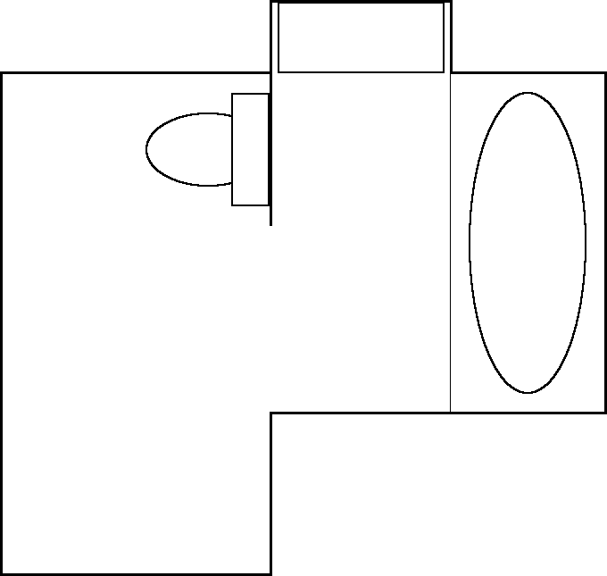

 

Above the bathtub were two windows, which I blotted out with cardboard, then I would sleep lying down in the little doorway between the two sections of the bathroom. The main door, leading out of the bathroom, which I also blocked off with cardboard, was directly across from the sink.

We tried to minimize outside light and external contact by covering all the windows and entrance with cardboard, but there was still light seeping through the edges. Consequently, I could tell if it was morning, afternoon or night, but had little more external input than that. Time was completely subjective, and the numerical passage of time depended on how I judged time to be passing, not the sun.

For food, I brought two 10x24 boxes of non-perishables and two ice chests, one of which served as a long-term storage and actually still had ice in it by the end of the week, while the other melted in the first three days.

Non-Perishables:
* Three loaves of bread
* Peanut Butter
* Jam
* Tuna
* Snacks
  * Chips
  * Granola Bars
  * Pistachios
  * Fortune Cookies
  * Gummy Bears (six a day)
  * Pretzels
* Cheese bagels
* Pita bread
* Granola

Perishables:
* Three different salad variations
* Guacamole (and avocados)
* Cheese
* Sour cream
* 1/2 gallon of milk
* Mayonnaise (for tuna later in the week)
* Salsa
* Hummus
* Yogurt

I'm sure there was more, but I can't quite remember all of it. I _definitely_ over-packed and over-rationed, because by the end of the week, I still had probably enough for another whole week. However, it was nice to have extra food, because it reduced the stress of potentially running out of food and having to end the endeavor early. I created a menu for the week, which I loosely followed:

<a href="../attachments/isolation/menu.jpeg" target="_blank_">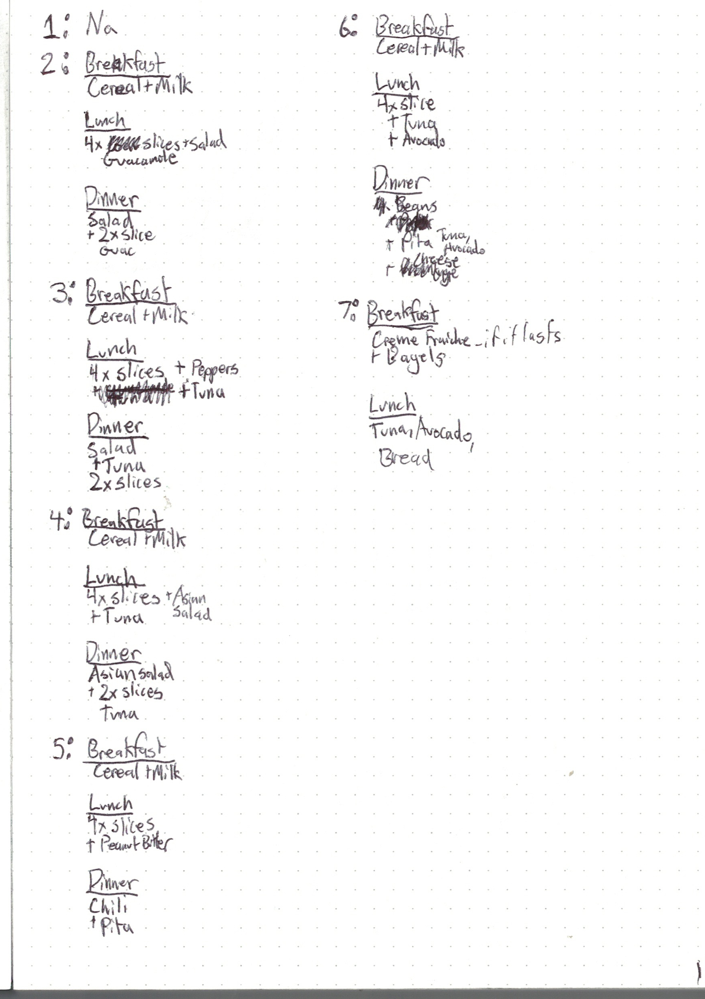</a>

 

---
### The Week

I entered the room on Saturday, June 8th, near nighttime, having spent the day finalizing the plans and making sure I had everything I would need. I emptied out all of the drawers, to get rid of as many distractions as possible, and simply piled all my supplies into a corner of the room, knowing that I would have nothing but time to organize it later. When I entered the room, I immediately started getting ready for bed, and wrote one entry into my journal. As you can see, I scanned my journal, and will be referring to these pages as I talk about my experience.

<a href="../attachments/isolation/journal-d1.jpeg" target="_blank_">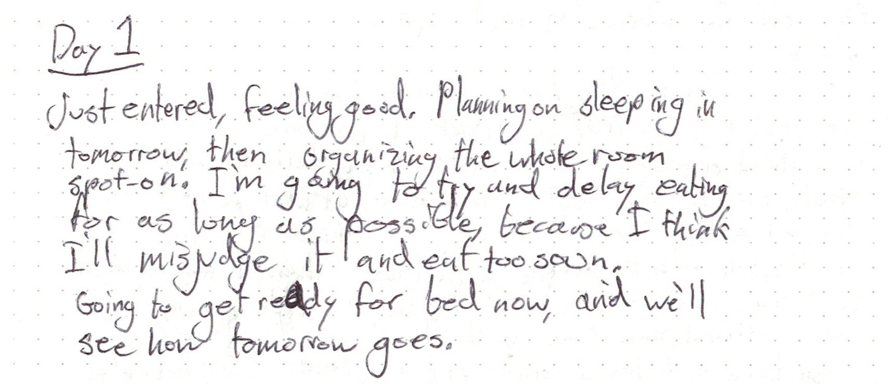</a>

 

Apologies for my handwriting, it's definitely not the neatest. I most likely should have spent more time putting care in my writing, it's not like I had anything better to do, but I rushed through it because my train of thought often moved faster than I could write.

#### Day Two

On my first full day, I began the day by organizing. It probably took me about a half-hour, but I can't be sure. At this point, I was still feeling the excitement of starting a new thing, and so was going faster than I probably should have. I had realized that I should try to sleep in as much as possible to minimize how much time I spent awake, but according to my parents, that first day I had woken up around seven in the morning. In this first day (along with the second one), I was terrified of over-eating and running out of food early, so I ate a lot less than I probably could have. In retrospect, it was a really unreasonable thing to be worried about, because worst case I would have just walked out early, but in the moment, I think I was fixating on it because I had little else to fixate on. I also made myself some tea after breakfast, and drank it contemplatively. It's funny to see how my journal entries diminish in frequency throughout the week. Here, you can see how often I updated, almost after every activity, regardless how minor it was! By the end, I was doing one, two entries a day, but more sizable ones.

<a href="../attachments/isolation/journal-00.jpeg" target="_blank_">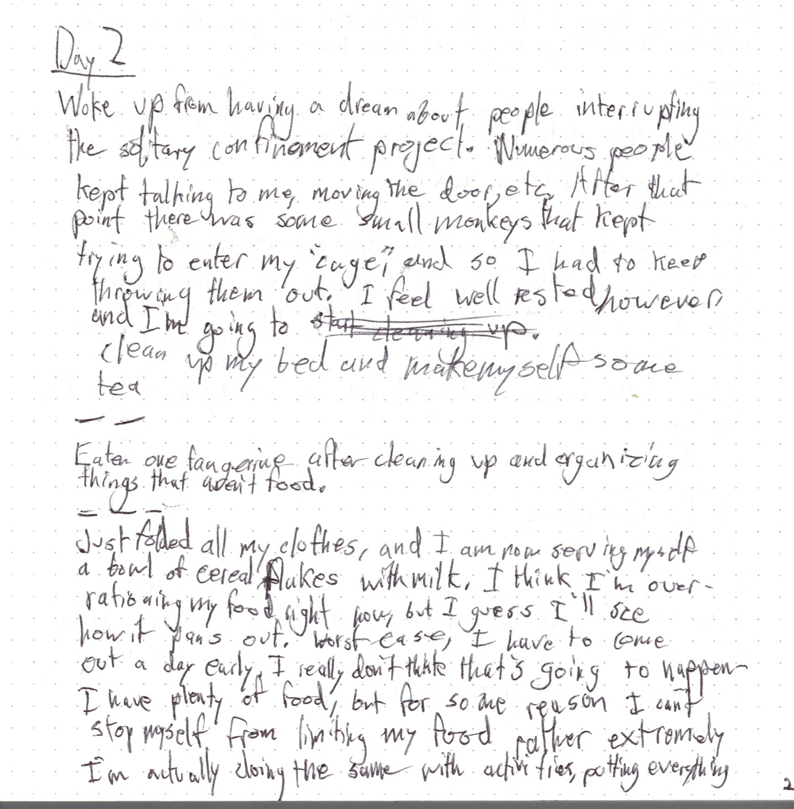</a>

<h5>I changed scanners after the first page</h5>
 
<a href="../attachments/isolation/journal-01.png" target="_blank_">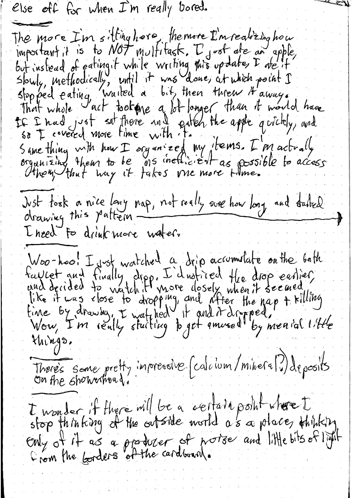</a>

 

Notice here how petty a lot of the things I was bothering to write down were. It's like I had a romanticized notion of what it meant to be in solitary confinement that I needed to be _super_ detail oriented, so I was behaving to try and fit that idea. As the day went on though, and I started running out of things to do, I began coming to terms with the fact that what I was doing wasn't going to work. It's too repetitive and even though it passes the time, it was something that got boring quickly and after the romantic notion wore off, I started trying to think of better things to do with my time. This was probably around ten in the morning, and to pass the time while thinking, I also began doodling. I drew this pattern:

<a href="../attachments/isolation/journal-02.png" target="_blank_">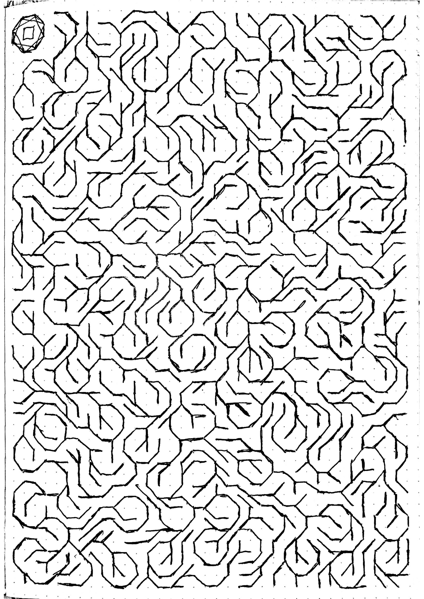</a>

 

This was the first of many patterns that I would draw throughout the week. These were really cool; the way I would create them was by giving myself a simple set of rules, then following them in drawing the pattern. It was a very engrossing task, and I think this was one of the things that over the week kept me most sane. You'll see more of them as we get deeper into the week.

<a href="../attachments/isolation/journal-03.png" target="_blank_">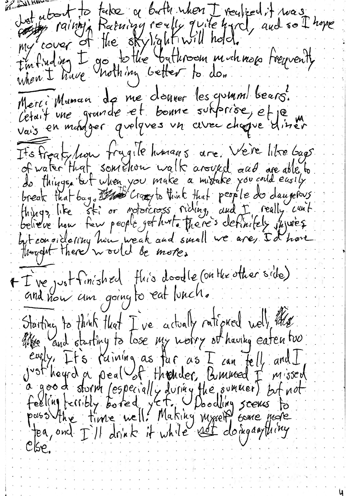</a>

 

You'll notice at the top of this page that I said it was raining. For a little while I toyed with the idea that my parents were trying to trick me by pouring pebbles over the roof and shaking a piece of Plexiglas to simulate thunder, but reason won out and I decided that my parents would not play a trick like that on me. This rain was incredibly lucky, not only because I live in Davis where rain during summer is like seeing a cat riding a tricycle, but also because it gave me some input from the outside world, however minor, during my first day. I didn't realize this until later, but that rain made the passage of time _much_ more bearable. That simple ambient noise, which was lacking later in the week, was a nice way to ease into the complete isolation.

I was kindly surprised by my mother while looking through my food because she had hidden some gummy bears along with my other rations, so I wrote a thank you to her. You'll also start noticing musings that I wrote in the journal. I had little else to do, so I now have a backlog of them that you'll see in the next couple weeks as I forget to write a musing for a day and so just copy one of these. Finally, you can see my analysis of the food situation, and also mentioning that I was going to drink some tea. I had begun going out of my way to not multitask, because I felt like I needed to stretch out each activity and slow down my actions to fill my day. Even though it probably didn't pass the time as much as the large blocks of doodling did, mentally it gave me the feeling that I was making an effort, and that helped just as much as actually passing time did.

After this point, I did a bit more doodling and musings, which I won't show here, but you can read in the full download of the journal [here][1]

<a href="../attachments/isolation/journal-07.png" target="_blank_">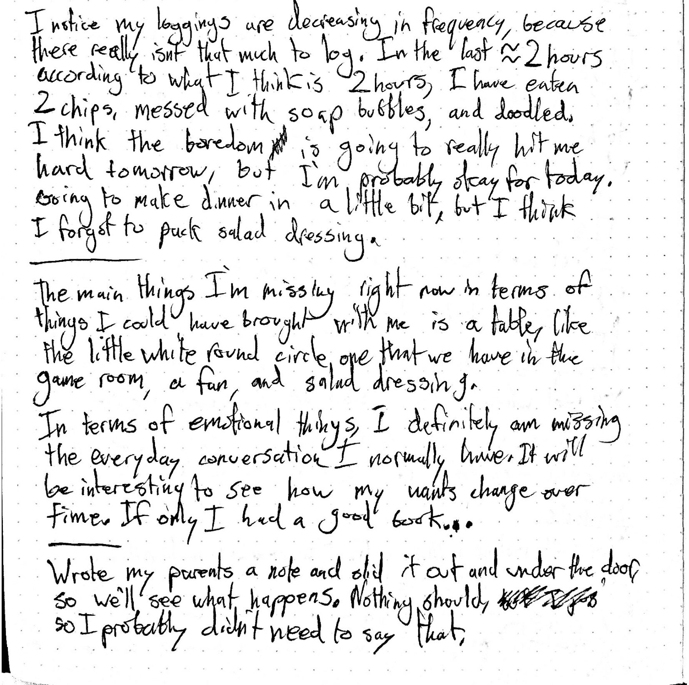</a>

 

It's funny to see how even in the first day I'm starting to notice how my logging is getting less and less. This was nearing the end of the day, so I wrote my parents a note letting them know I was doing okay. I also checked myself to see how I felt and see what I was missing most. I wasn't really missing much other than stimulus, so I think now, looking back at it, that I wrote those physical goods sort of as a placeholder, because I felt like I should really have been missing something even though I wasn't really.

Below are some more doodles from that day, and some from the next full day (I didn't fill up the page completely), and then the next pattern, which I started but didn't finish till the next morning.

<a href="../attachments/isolation/journal-08.png" target="_blank_">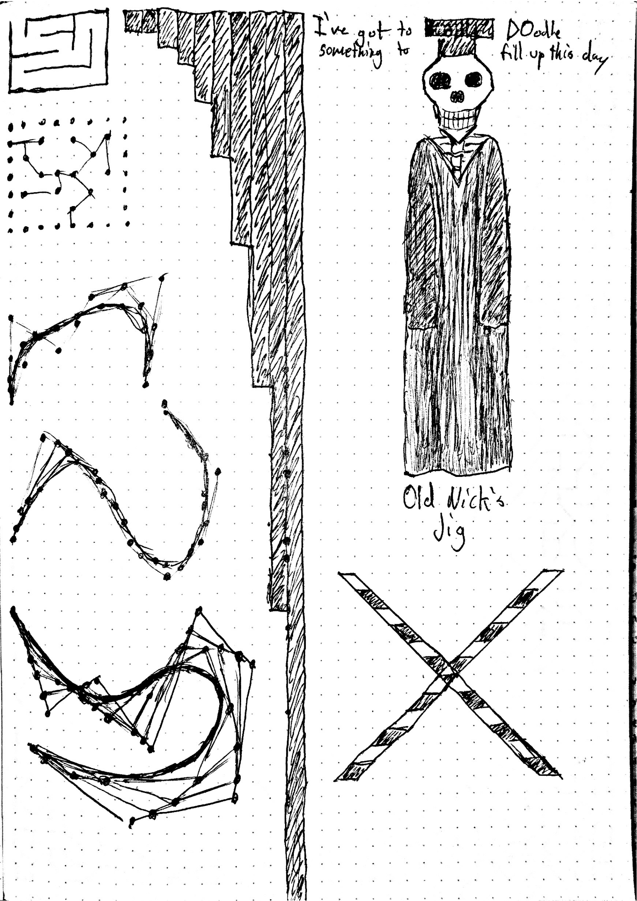</a>
<h5>Splines and Fibonacci sequence!</h5>
 

<a href="../attachments/isolation/journal-09.png" target="_blank_">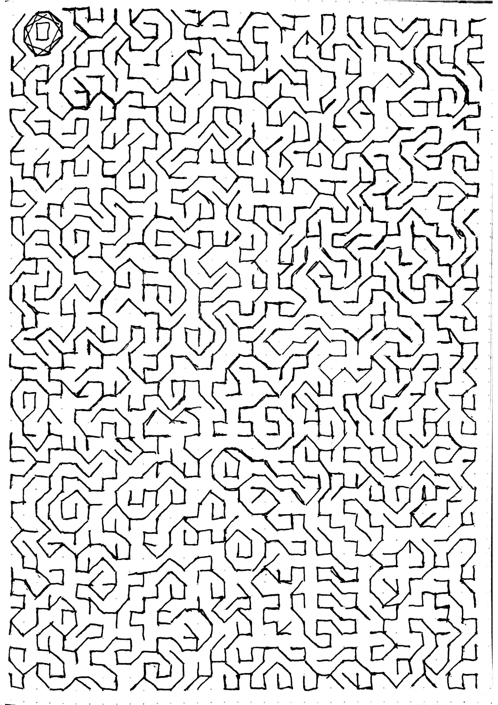</a>

 

That rounded out the first full day, and I wrote one more entry before falling asleep.

#### Day Three

I woke up later this day, and tried to stay in bed for as long as possible. One definite bonus of doing this experiment was the amount I caught up on sleep after the school year and finals week draining my energy completely.

<a href="../attachments/isolation/journal-10.png" target="_blank_">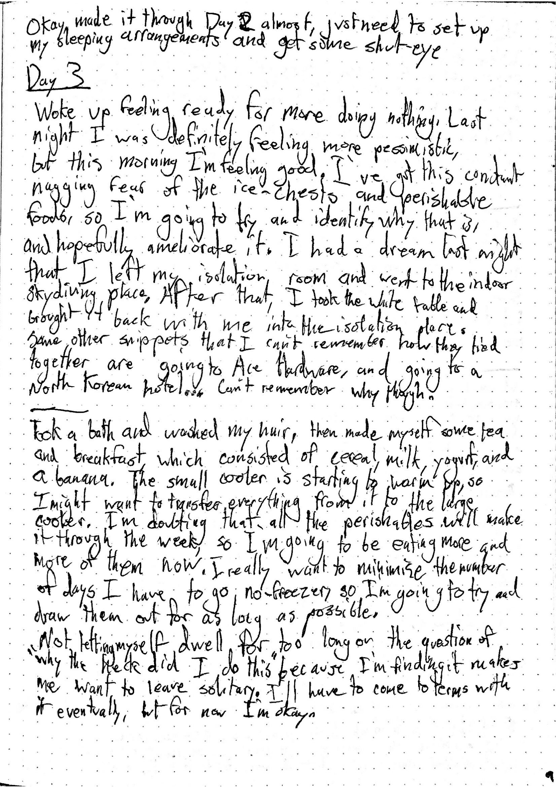</a>

 

At this point, I noticed that my mood the night before had been really pessimistic and was a lot worse than my mood in the morning. This would be a recurring pattern; mornings would pass quickly and easily, then the moment I ate lunch, it felt like the day would stretch on forever. As far as I can tell, there were two reasons for this. It's possible I was eating lunch early, so the morning actually _was_ shorter, but I was trying to stay conscious of that and not eat lunch until I was really hungry and had seen the light subtly changing in the borders of the windows that made me think that there were shadows caused by the sun being past its high in the sky. The other reason I think it was difficult was because I would start questioning why I decided to do the experiment later in the day, when I would start thinking of other stuff I could be doing.

<a href="../attachments/isolation/journal-11.png" target="_blank_">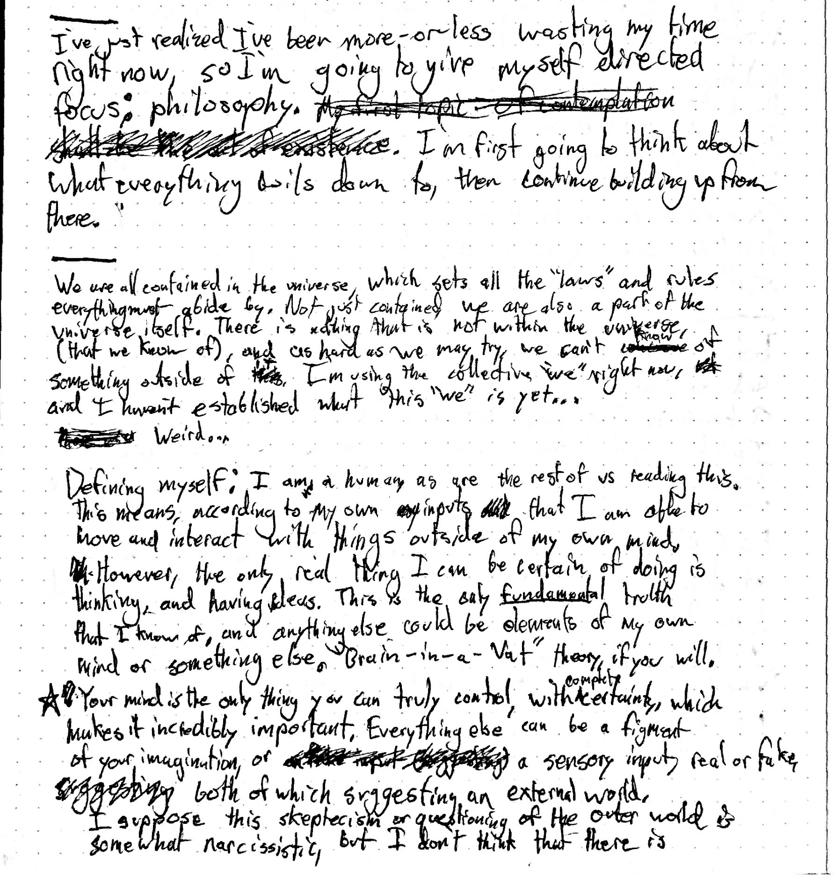</a>
<a href="../attachments/isolation/journal-12.1.png" target="_blank_">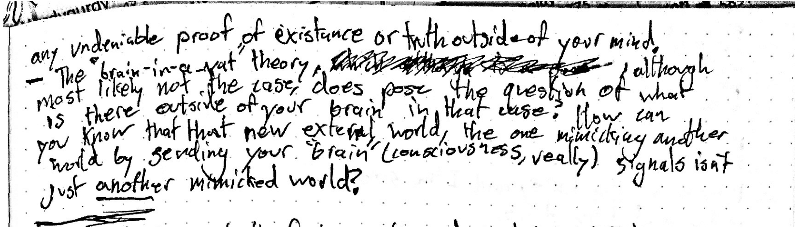</a>

 

It was at some point in the morning here in the second day that I started realizing that I wasn't being that productive with my time, and that I should really try and spend the time thinking about more meaningful things. Thus, I settled on trying to identify what the universe is composed of and our existence in it. A lot of the stuff I said doesn't really make sense and I was just writing down potential ideas to see if I could come up with anything I was happy with. I went down the brain-in-a-vat theory for a little while, then realized that a lot of what I was saying was probably already said by other people much earlier in their own explorations of our minds, so I stopped.

<a href="../attachments/isolation/journal-12.2.png" target="_blank_">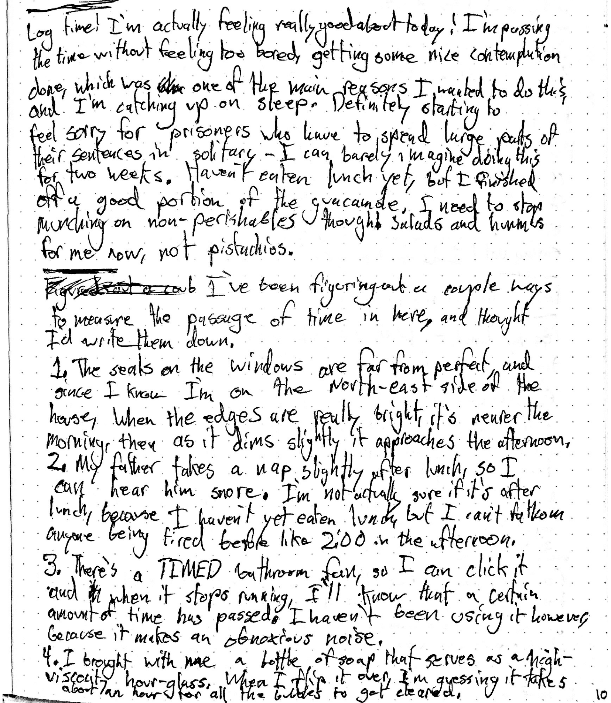</a>

 

Around this point I decided to write down how I had figured out how to measure the passage of time, even though I wanted to try and avoid knowing exactly what time it was. For that reason, I didn't use the things I had figured out very frequently, but they did give me a sense of time. I definitely realized how much I overestimated the amount of time that had passed. It keeps going for a little bit below, then I returned to petty logs while doodling.

<a href="../attachments/isolation/journal-13.png" target="_blank_">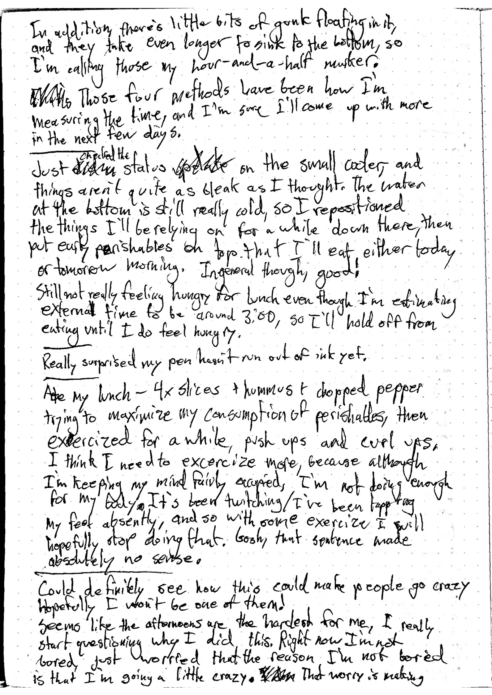</a>

 

At the bottom of the above page, and in the one below, I began questioning my will to do the experiment. This was probably the worst part for me, out of the entire week, and there was definitely a few moments where I stopped doing what I was doing and got up and stood in front of the cardboard covering the door for a while. My worry and doubt continued onto the next page. This was after lunch, which, like I said, was the hardest part of the day for me. I began thinking that the behavioral ticks that I normally exhibit were signs of my brain seeking stimulation, and so this was making me worried. I would be tapping my foot absently while doing something, or snapping while thinking, and even though I do that normally, my attention was drawn to it and for probably and hour I sat there, willing myself to not do anything. I meditated for a while to try and calm myself down, then realized, with a burst of joy, that I needed something to take my mind off of itself. I then decided, at that moment, that I would request for three books from the outside world to keep me company. I didn't do it immediately, because just the thought of having books made me feel better, so I started thinking that perhaps it wasn't the books that I really needed. Instead, it might have just been something to look forwards to. Even without the books, at that moment, when I decided I was going to obtain some, the pressure and worry I had been feeling for the afternoon dissipated completely. There's definitely something to this, and I think it's that having something to hope for gives us the ability to put up with a lot of stuff. I'll talk about this more in the analysis of the week.

<a href="../attachments/isolation/journal-15.png" target="_blank_">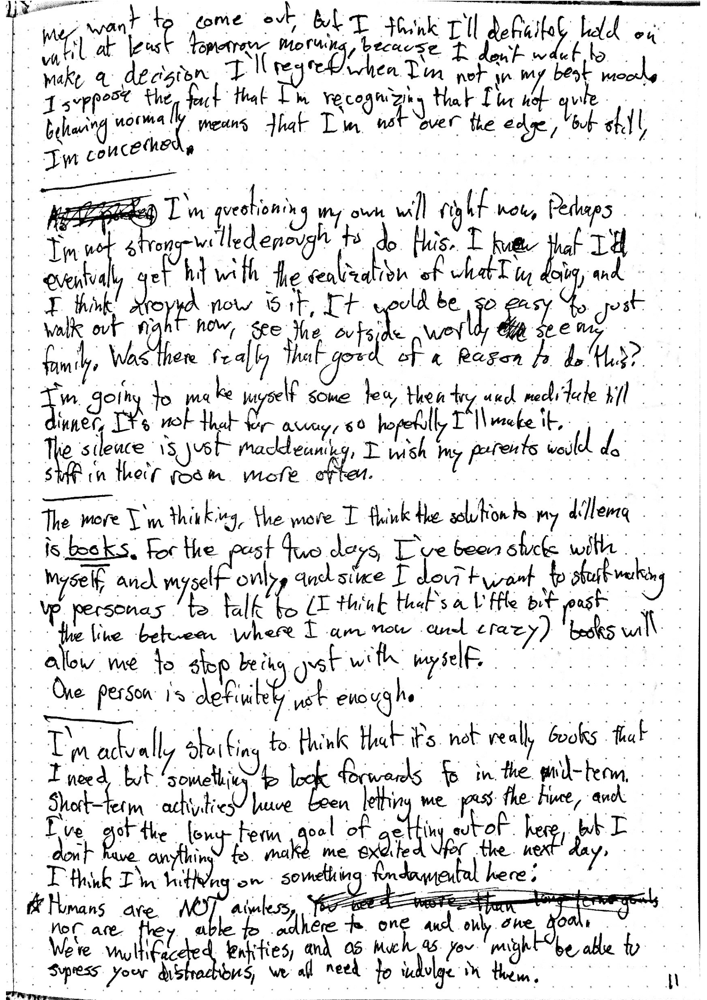</a>

<a href="../attachments/isolation/journal-14.png" target="_blank_">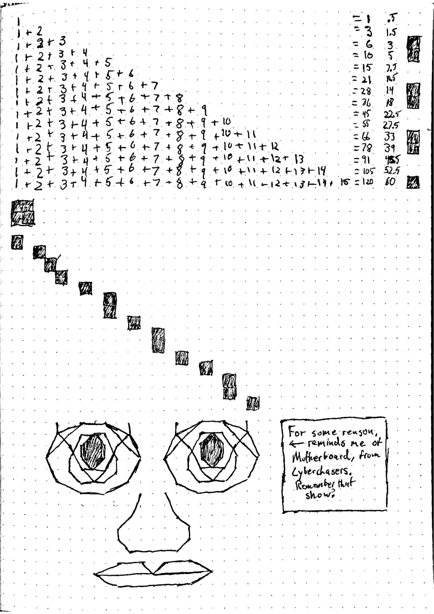</a>
<h5>More doodling and looking for a pattern between numbers</h5>
 
<a href="../attachments/isolation/journal-16.png" target="_blank_">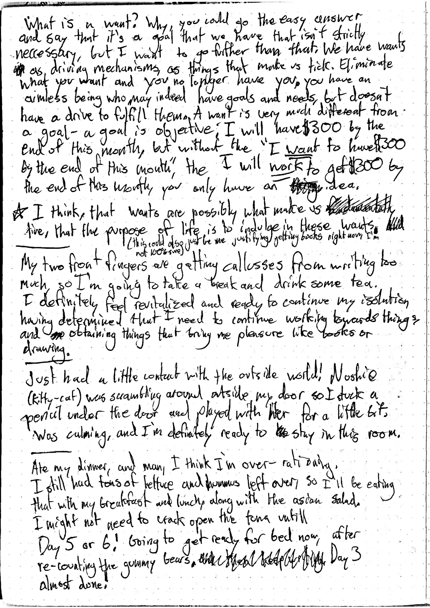</a>

 

I kept trying to analyze this idea of wants versus needs, but I don't really think I made much headway. Thankfully though, by this point, my doubt had passed and I had decided to continue the experiment. This was nearly night time by this point, so I made myself a dinner of bread with hummus and lettuce, and went to sleep.

Wow, this got a lot longer than I thought it would be, so I'm going to split it into two parts.
[Click here to go to the second one!][2]

[1]:../attachments/isolation/journal.pdf
[2]:../post/2017/06/21/isolation-pt2.html
