This is the second part to my experience in isolation, if you haven't read the first part, [click here!](../post/2017/06/20/isolation-pt1.html)

#### Day Four

I realize I didn't specify this earlier, but I had decided to delay my acquisition of books until Day Five, so I had this final day of no books to get through. I left the picking of books up to my parents, which I think was a good idea. You'll see why once I go over the books I recieved. I started the fourth day much like the third, staying in bed for as long as possible, then when I finally got out, I only slowly cleaned up my sleeping arrangements and made myself a cup of tea. I started a pattern as well.

<a href="../attachments/isolation/journal-18.png" target="_blank_">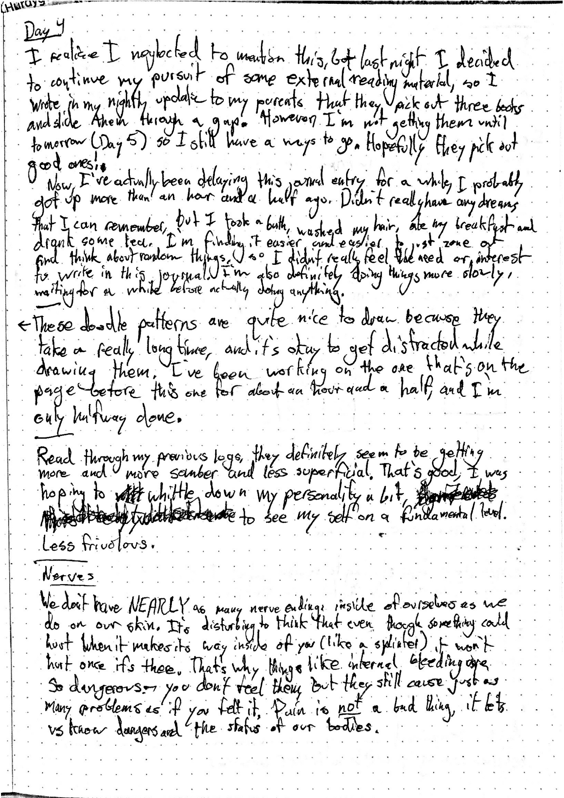</a>

 

<a href="../attachments/isolation/journal-17.png" target="_blank_">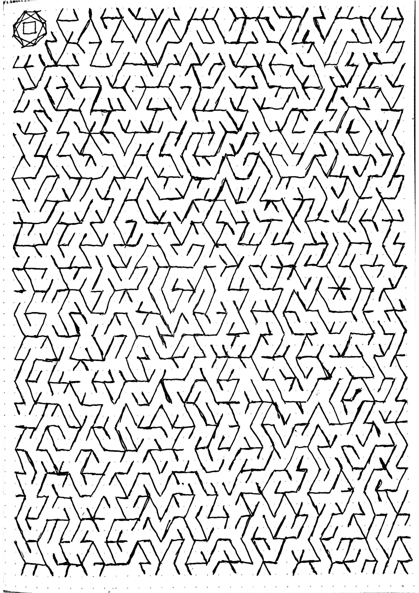</a>

 

<a href="../attachments/isolation/journal-19.png" target="_blank_">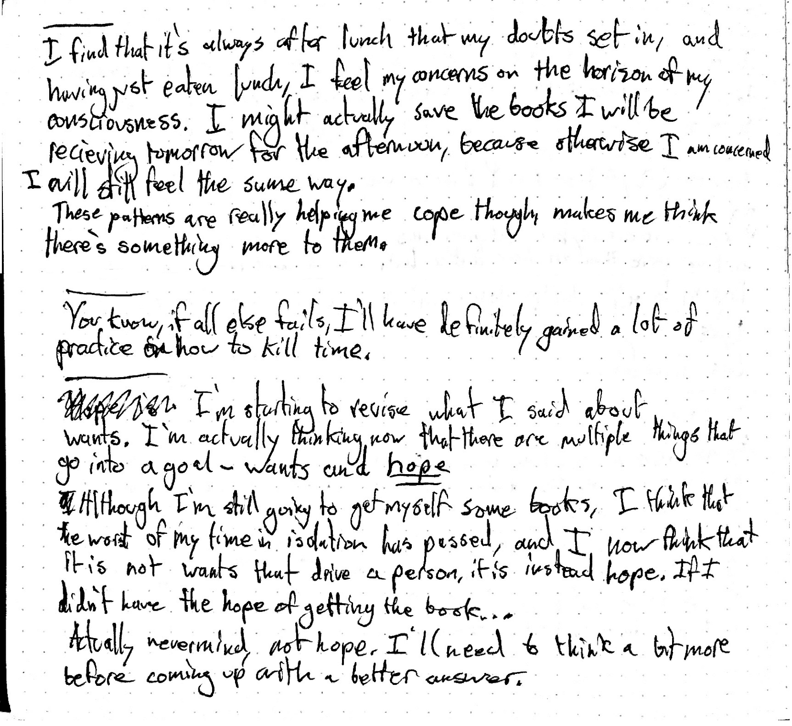</a>

 
Here, I continued contemplating what suddenly had eased my ill-feelings from the day before, because I really wanted to pinpoint how I could use that idea in other situations where I'm either doing stuff I don't want to do, or when I'm feeling stressed. Again, I'm focusing around the idea of a want, but this time in relation to hope. I still don't think I've flushed this out, even though the things that changed were all within my mind.

<a href="../attachments/isolation/journal-20.png" target="_blank_">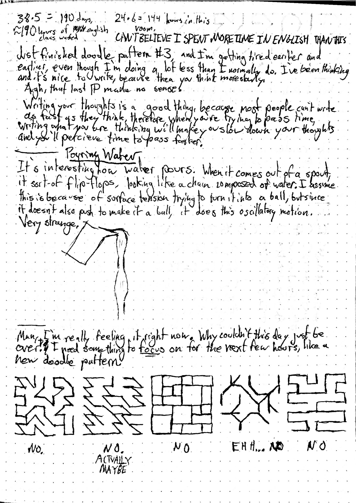</a>

 

I realized while writing and doodling that the very act of writing out on pencil or pen and paper was very nice, because it forced you to slow down your thoughts and not have them bounce all over the place. This experience has definitely made me want to take notes on paper, even when I'm in college and people take notes on computers. Something is nice about how you are forced to consolidate your thoughts to come together into coherent sentences that can take time to craft and are difficult to fix once written. Here you can also see a musing that came about from when I was pouring myself some tea. My attention was drawn to the water going out the spout and I noticed a cool phenomenon.
By this point, I had reached the dreaded afternoon, which you can see at the bottom of the page. I started looking for a new set of rules for a new pattern but I was having trouble coming up with them. There are some more below as well.

<a href="../attachments/isolation/journal-21.png" target="_blank_">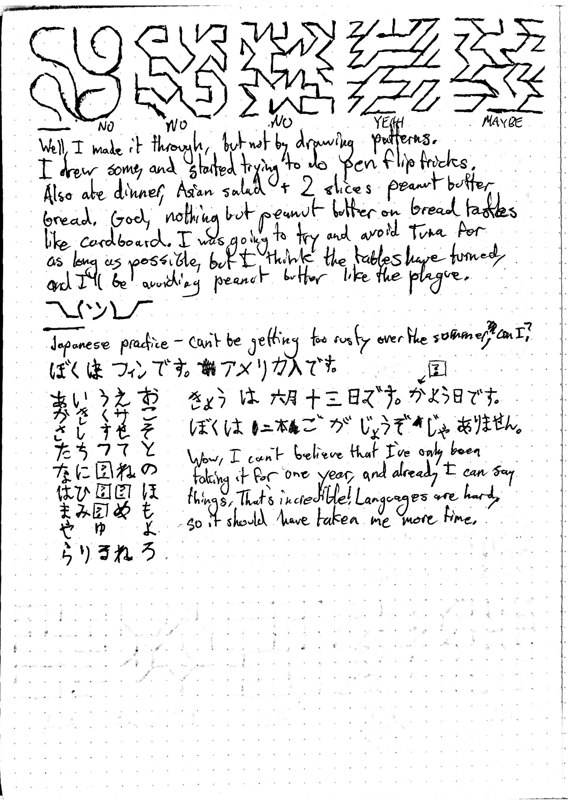</a>

 

I started taking Japanese last year, so I took some time to practice it and see if I could remember all of the Hirigana. Looks like I couldn't, but while I was doing it I realized how incredible it is that we're able to pick up other languages in such short time spans. I'm not calling myself proficient in Japanese by any means, but the fact that I can at least form sentences and decipher the speaking of other people is shocking to me. I already spoke French and English, but having learned those as a young child, I didn't really ever have the experience of being conscious of my advancement in the comprehension of a language.

<a href="../attachments/isolation/journal-22.png" target="_blank_">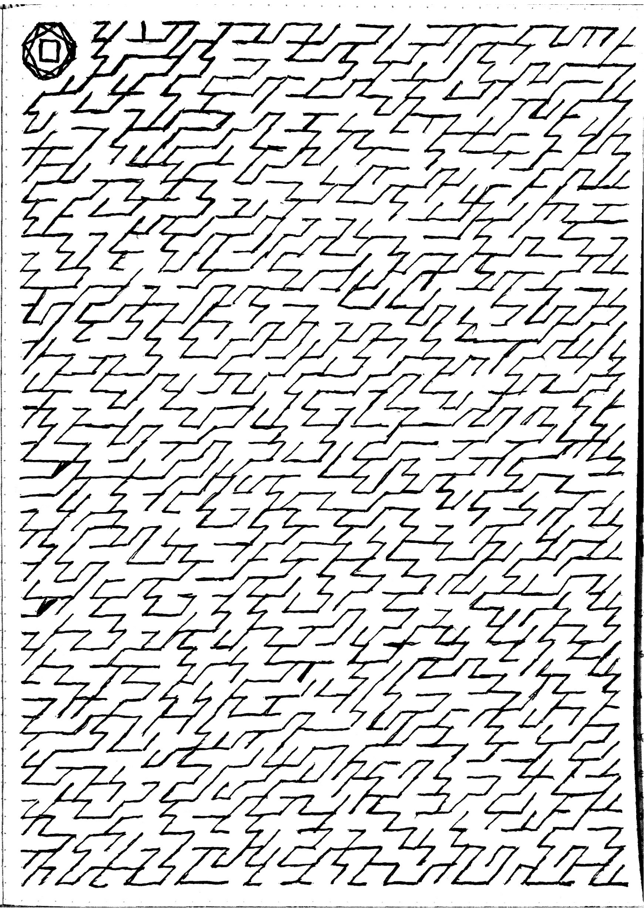</a>
<h5>Another pattern. I really like this one, even though while first trying it out it didn't resonate with me.</h5>

 

#### Day Five
This was the day I got the books! My loggings had already gotten a little bit less frequent, but with the books they decreased even more. However, as soon as I got them (probably about an hour after I woke up), I didn't read them, because I was determined to write some more stuff before I cracked into them and get some final unpolluted thoughts down. It was like a sudden gush of things I had been thinking about but not written down to this point, and then after writing them down I cracked into the wonderful world of not just my thoughts and the bathroom I was situated in. It's like the arrival of the books rejuvenated my thinking, bringing a mini renaissance, and I was able to write down some stuff that I hadn't really nailed down until this point.

<a href="../attachments/isolation/journal-23.png" target="_blank_">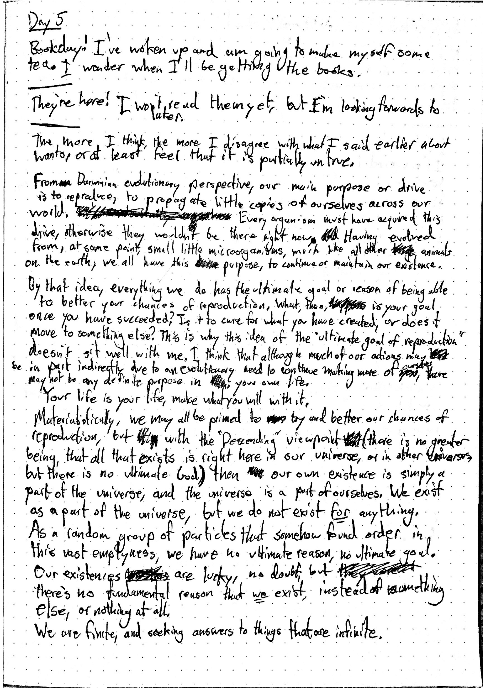</a>

 

The books I was given by my parents were _Stranger in a Strange Land_, _A Brief History of Everything_, and _The Book: On the Taboo Against Knowing Who You Are_. Personally, I found Alan Watt's book to be a little bit obnoxious. I'm not sure why, but although I definitely like Alan Watts' lectures, his written works get on my nerves. I refrained from reading a lot of it during isolation.

<a href="../attachments/isolation/journal-24.png" target="_blank_">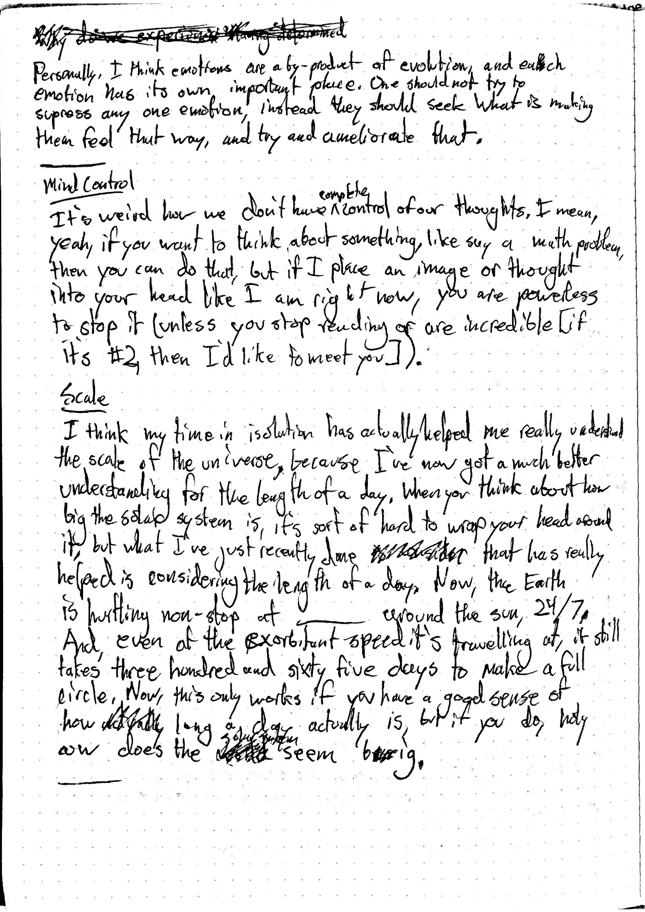</a>

 

The first book I read was _Stranger in a Strange Land_, because it was fiction and I was really looking to lose my mind in a good book. I started late in the morning, and finished by the end of the day.

<a href="../attachments/isolation/journal-25.png" target="_blank_">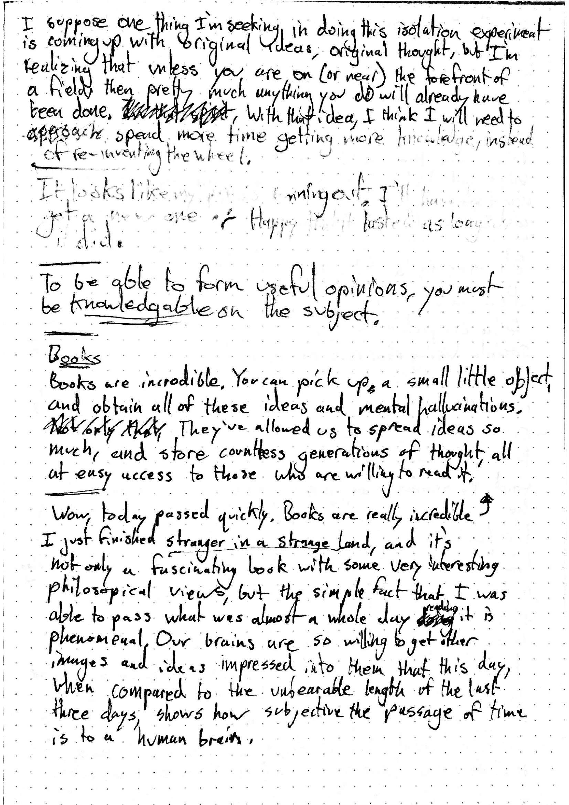</a>

 

I finally ran out of pen ink in my first pen around mid-afternoon of this day. I'm honestly super surprised that the single pen I was using for the previous four and a half days didn't run out of ink sooner, with all the writing I had been doing, but I guess it had a larger reservoir than I had thought.

I definitely didn't write or do as much this day, because I was so engrossed in the books. It's incredible how our brains are so willing to get ideas imprinted into them. However, later in the day, I started reflecting on how my thinking had changed during isolation. I think that I definitely set some good mental habits during isolation, taking the time to really think about things, instead of quickly flitting from idea to idea like I did in my day to day life. I've been trying to continue that outside of the room, but it's a lot harder when you have all this stimulus.

<a href="../attachments/isolation/journal-26.png" target="_blank_">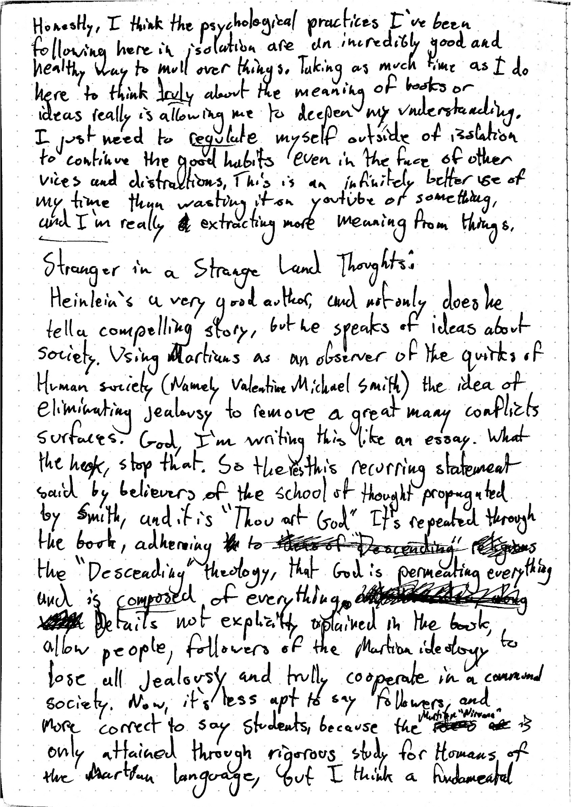</a>

 

<a href="../attachments/isolation/journal-27.1.png" target="_blank_">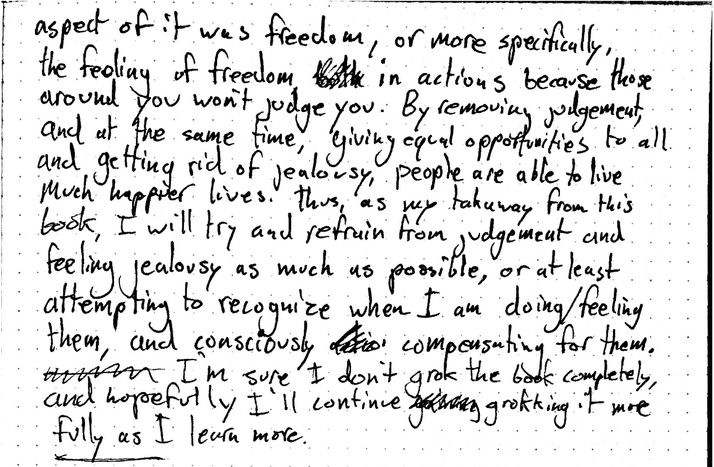</a>

 

_Stranger in a Strange Land_ was really good, so I wrote a little about it and how I interpreted the book. I realized a little ways in that I was writing my analysis like an essay, which is sort of sad. We've been conditioned by the school system to write things in a certain way; Five paragraph papers are _far_ too common, and so when I became conscious of it, I tried to write differently, more casually and less like a book report.

#### Day Six

The last full day! I started it out feeling very optimistic, having realized that there was no way I could run out of resources early and not having much longer in the room. I wrote _a lot_ less this day, but still did one of my doodles. I had been sending out status updates to my parents every night, but I realized that I had forgotten to send one the night before. _Stranger in a Strange Land_ had taken all of my attention and sort of thrown me off of my schedule that I had gotten used to in the room.

<a href="../attachments/isolation/journal-27.2.png" target="_blank_">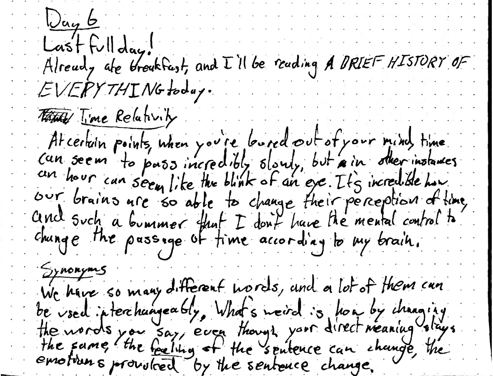</a>

 

Ken Wilbur has some really good insights on the world and how our minds work. I read a good portion of his book, taking all the pauses I could to try and mull over what he was saying. I can't say I agree with everything he said, but he takes a lot of different philosophical theories and combines them very aptly.

 

#### Day Seven
This was the final day of the experience, and I got let out mid-afternoon. I had decided the night before to finish the experiment off without books for the final part of it, so I took some time to think about what I had read and also do one more doodle pattern.

<a href="../attachments/isolation/journal-28.png" target="_blank_">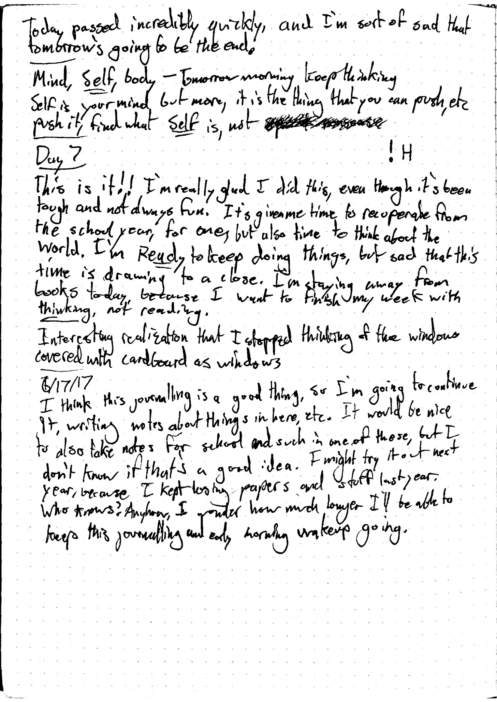</a>
 
<a href="../attachments/isolation/journal-30.png" target="_blank_">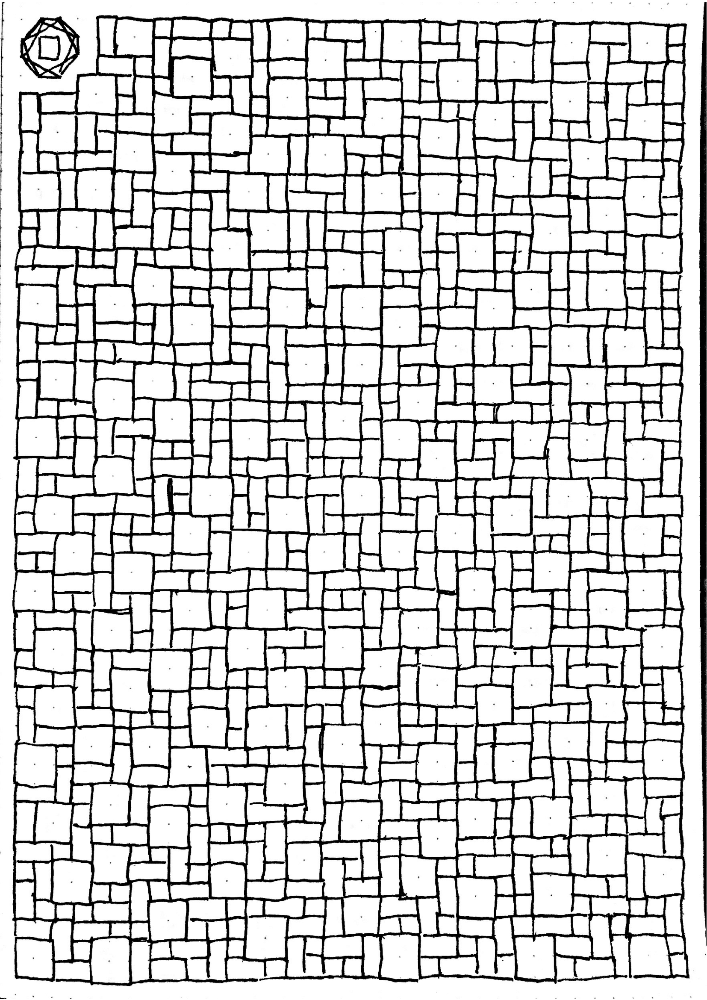</a>

 

When it was nearing the time that I thought would have been when my parents were going to let me out, I started getting really high-strung, and the last hour or so was really difficult because my emotions were on a tire swing. If I heard footsteps, I would immediately think "Oh boy, they're coming to get me!" only to realize that someone was just walking through the house. However, when I finally started hearing the door move, I got super excited and tore down the cardboard covering the door, and when they opened the door I was _incredibly_ happy to see my family again.

Walking out of the room, the first thing that struck me was how my eyes had adjusted to seeing things from close up. A tree, outside the window of my parents' room, seemed very large and far away. I had been trying to keep my eyes from getting too used a short range by looking though the mirror and closing my eyes and focusing on something I imagined to be far away, but I guess it didn't do much. I didn't suffer any permanent eye damage, but for a little while focusing on anything far away felt weird. Second, I realized I was a lot shakier on my feet than I would have thought. I hadn't walked a long distance (even down a hallway) since I had entered, so going at any constant speed for more than a few seconds sort of threw me off.

After leaving the room, I went outside and sat with my parents, and we talked for about a half-hour. Thankfully, my parents had decided to record my exiting the room, and just left the camera rolling, so I have the recording of that interview [here][1] on Youtube.

It was difficult and not fun for a lot of the time, but I think it was a positive experience overall. Not only do I now have the knowledge that I was able to sit in a room for a week, something not many people have voluntarily done, but I got a better sense of how my mind works and of myself by doing it. We're all only human, but by knowing what _makes_ you human, you can get a lot done and feel a lot better. Only by pushing yourself and finding your limitations can you expand them.

Again, if you want to download the full journal, [here it is][2], and I totally recommend to anyone who might be thinking of it to try and do some isolation. It's probably not what you're expecting it to be, but it makes you more conscious of a lot of the things we take for granted, and was an experience I'll definitely repeat in the future.

I'm actually going to keep doing mini-isolations every week, because I want to keep the mentality that I think arose with doing the experiment, so I'm planning out a half-day a week to return into the room and think.

[1]:https://youtu.be/UYrxBcIhawM
[2]:../attachments/isolation/journal.pdf
