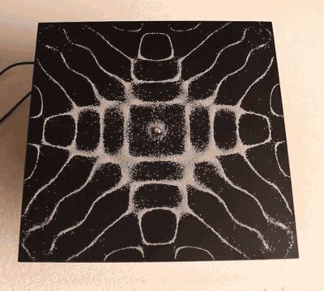
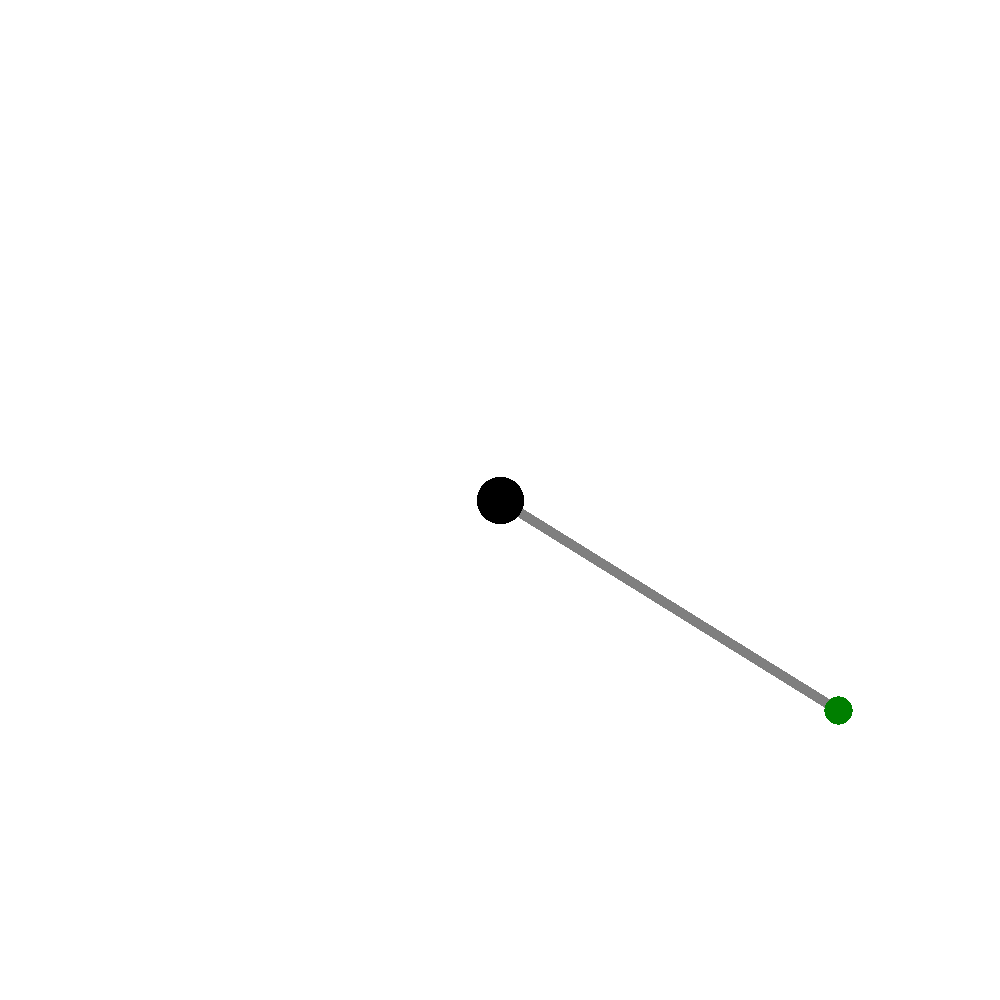
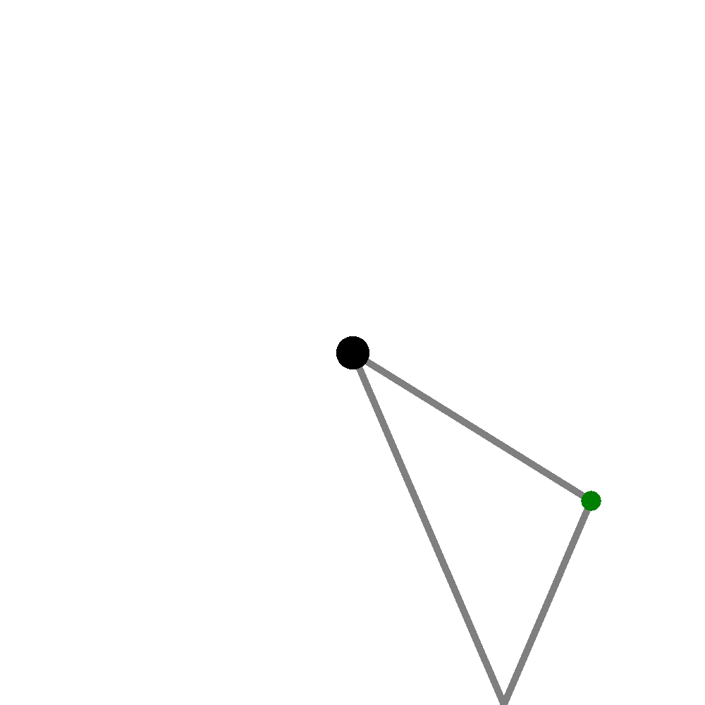
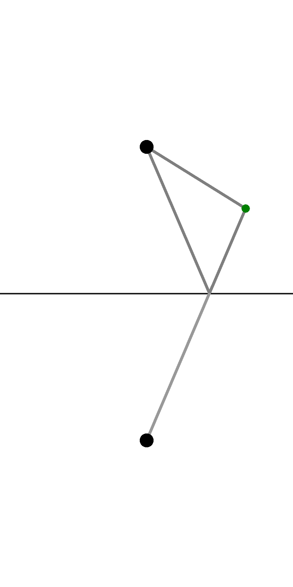
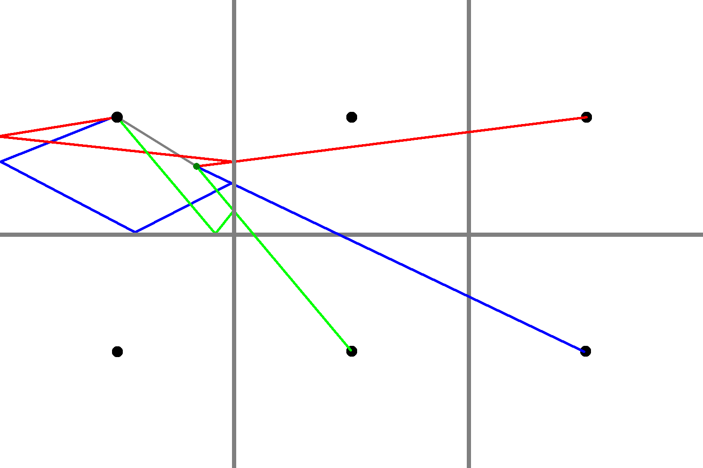

Have you ever seen one of those science experiments using a metal plate vibrating at certain frequencies, which forces patterns to form in sand distributed on the plate?

 

It's a phenomenon called Chladni patterns, named after Ernst Chladni, and they demonstrate two-dimensional regions of low and high vibration of a particular material at a particular frequency, also known as nodes and anti-nodes. Now, I've been mesmerized by these through countless YouTube videos and the like, but I never have had the opportunity to make a rig myself and experiment in person. However, I've had project related to this phenomenon on my mind for a while, and in lieu of buying the materials, I wrote a little software trinket that lets me generate them, or at least what I think are pretty good approximations of them. This blog post's objective is to explain some of the more interesting parts of how I'm thinking that Chladni patterns behave, and to document the code that I wrote to model it, which you can find [here](https://github.com/steampunc/toy-box/blob/master/chladni/main.py)

 
#### Disclaimer: This is all my own theories about how the patterns are formed, so take everything I'm explaining below with a grain of salt (or sand).
 

First of all, I want to talk about the idea of a [standing wave](https://physics.info/waves-standing/). When you have a string, or another object with a wave traveling through it, and you wobble it at certain frequencies, you'll get a bunch of waves that seem to vibrate up and down, rather than propagate side to side. These non-moving (they don't _walk_, thus the name "standing") waves have the property that at certain points along the line or string, called nodes, the string just rotates around that point. Also, we aren't just limited to having standing waves in a string/one dimensional object. They exist in 2d surfaces, and this is what a Chladni pattern is illustrating, with the sand converging on the nodes of a plate or surface at a particular frequency.

The reason the sand converges to the nodes is simple; as the sand reaches the nodes of the material (having been bumped around by the more active parts of the plate in a semi-random fashion), they reach a point where they won't continue to bump around because there's no vibration at a node. It's the same reason leaves seem to accumulate in inside corners of buildings on windy days -- Leaves are protected from the wind in the inside corners, and it's much more likely that there's going to be a gust of wind that pushes them into the corner rather than out.

Initially, my thinking for the model was to make some sort of a particle class, then have each particle bounce around in various directions depending upon their position on the plate until they came to a near-equilibrium. However, after programming a particle class (my logic was to start with the super trivial stuff), I realized that I was still in the same boat that I had been previously. I still didn't have a great method to determine how the particle bounced at any given point on the plate. It was all great to have particles that can move around, but unless I could figure out how they move, it was completely pointless.

I needed to identify how each point on the plate vibrated -- what makes a point a node versus an anti-node? It's not as simple as just tracing the waves out from the frequency emitter, because the waves reflect off of the edge of the material and return to interfere with the new waves coming out (this is part of the the definition of a standing wave: there needs to be reflection creating constructive and destructive interference). Also, if I considered the process as some sort of emission of moving waves, did that mean that for every point on an emitted "ray" or "wave", would I have to save the data? In thinking about it, it becomes evident that an emission approach would be ineffective. So, instead of doing that, I applied some concepts that pertain to [ray tracing](https://www.cs.unc.edu/~rademach/xroads-RT/RTarticle.html). Much like in ray tracing, I treated each pixel as a sensor, sent some rays backwards out from that sensor, then measured when they would intersect with the frequency emitter, positioned at the center of the plate.

However, just sending some number of rays out, and hoping that they'd intersect with the frequency generator would be super inefficient. Instead, to figure out the direction in which the rays emitted by each pixel should be shot out to most effectively represent the strongest interfering waves (single or double bounces, because after that point I figured that the reflected waves dissipated and their amplitudes were diminished), I used an interesting trick that's easier to explain with a geometric interpretation of the system.

If you consider the plate to be a square, with the dark dot as the frequency emitter, and the colored dot as the point you want to inspect, you can draw the simulation like this:

 

I've traced out the line that a wave in the plate takes directly from the frequency emitter to the inspected point. But, there's also going to be waves bouncing off of the edges of the plate that also contribute to the state of the inspecting point, so let's draw one of those in.

 

Just like light on a reflective surface, reflections of the waves at the edge of the plate conserve angles, and because of this (think of mirrors and how images work with mirrors), you can pretend that there is another plate right next to the "real" plate, and draw a line connecting to this secondary plate. Thus, instead of doing a bunch of reflection calculations, you can just pretend like there's another plate right next to the real one that you're modeling. Then, you can trace a straight line out, which represents the total distance that a wave would need to travel while bouncing around the edges, and use that length to figure out the interference at the point you are measuring.

 

This works for as many reflections as you want to measure, just by tracing the lines out further and further across more and more "imaginary" plates.

 

I suppose it isn't that interesting of a revelation, but in the moment of writing the software, I felt very clever. It's an example of how thinking about a problem through a different viewpoint can lead to a solution that's quite beautiful, rather than a clunky and tiresome implementation that might solve the same problem.

The rest of the code is fairly straightforward -- simply calculating the standard deviation of all of the various lengths of rays traced out from each point, and using that value to color the pixel representing that point on the plate. This lets us quantify the level of vibration at each point.

As for some improvements, you'll notice that the plate is symmetrical across both the diagonals and the vertical and horizontal lines going through the corners and center, so this implementation is still super inefficient. What I really should be doing is doing it for one of the eight triangles, then mirroring and rotating it to get the other parts of the plate. However, I didn't realize it in the moment and though I might come back to it eventually, I've moved onto other projects now.

To end the post, here's a gif of the modelled plate incrementing from a unitless frequency of 10 to 20:

 

And again, if you want to look at the code that this whole post has been talking about, [here it is](https://github.com/steampunc/toy-box/blob/master/chladni/main.py)

